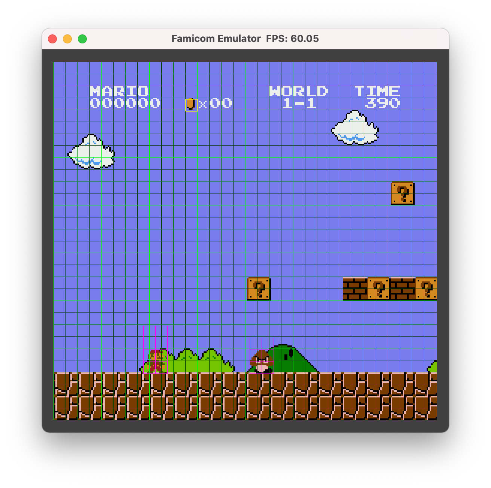
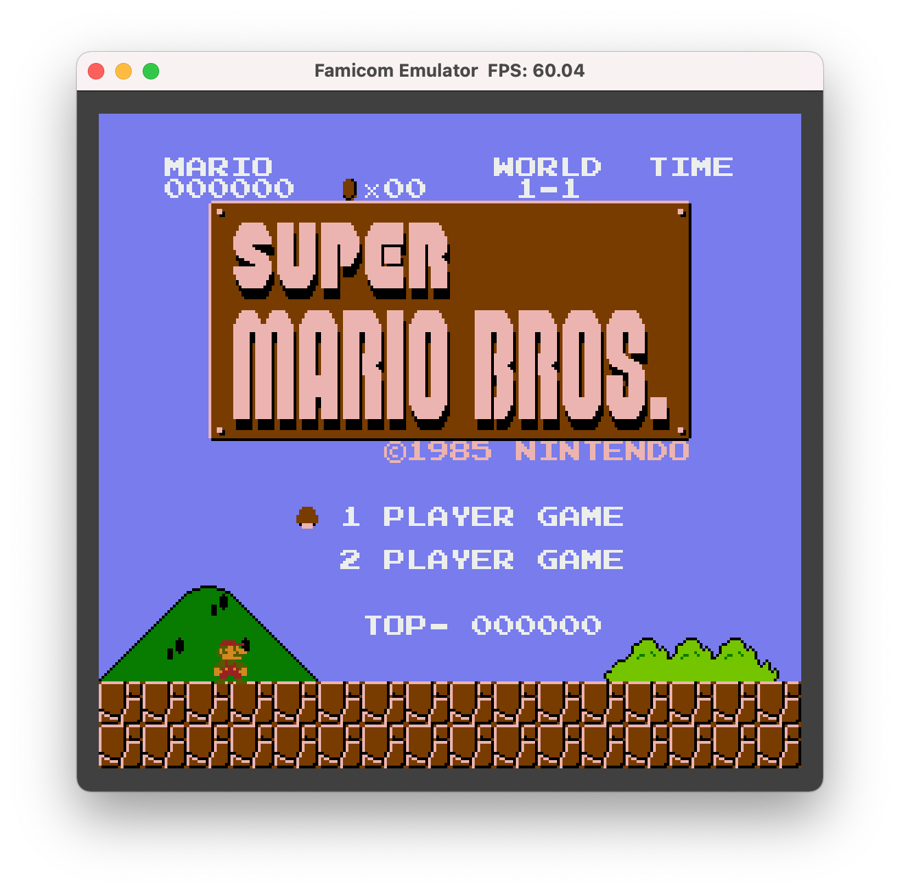
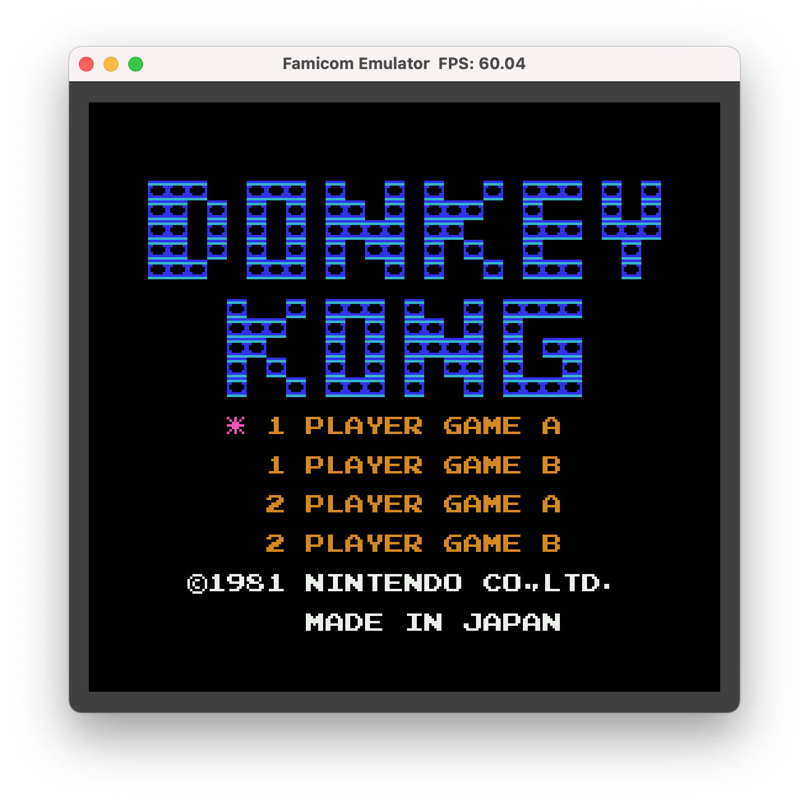
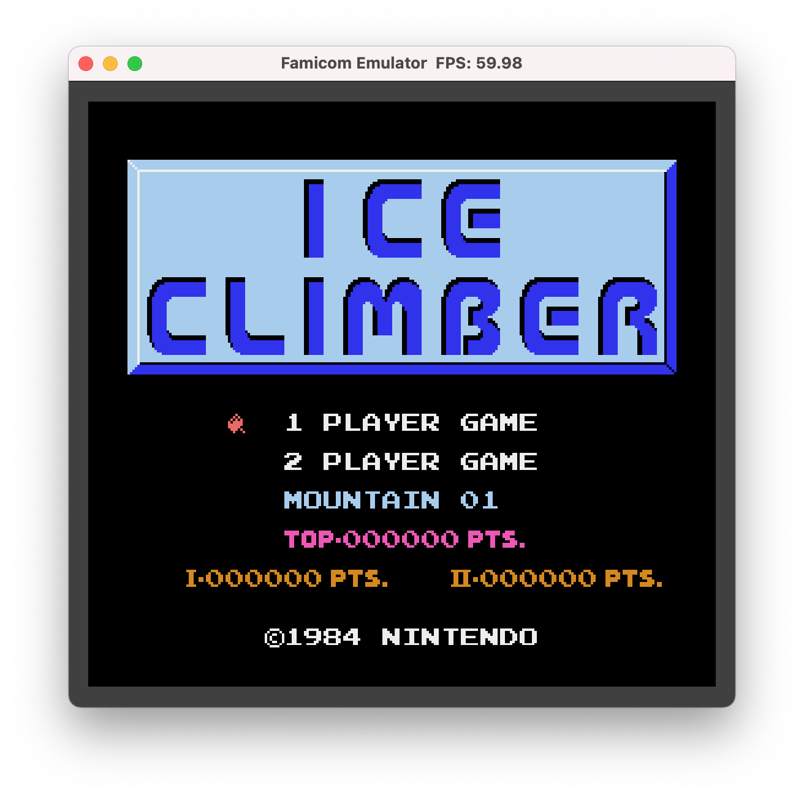
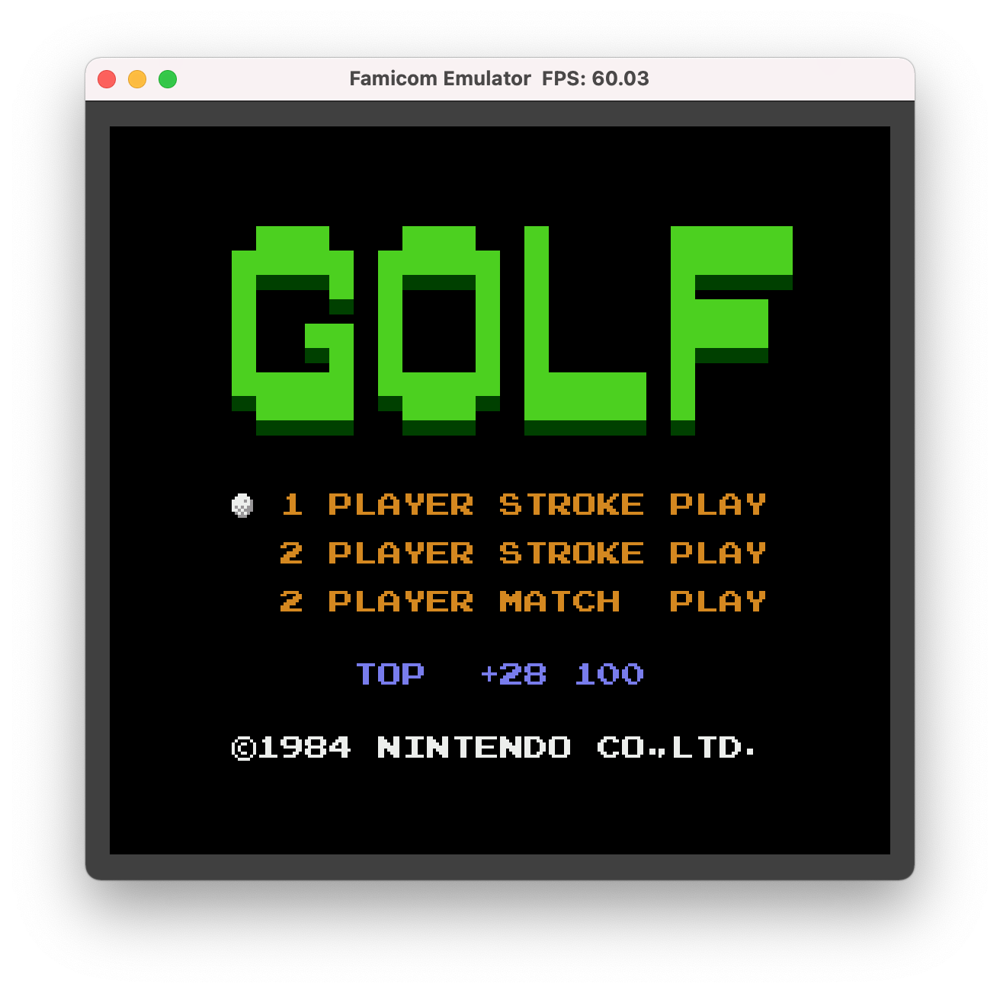
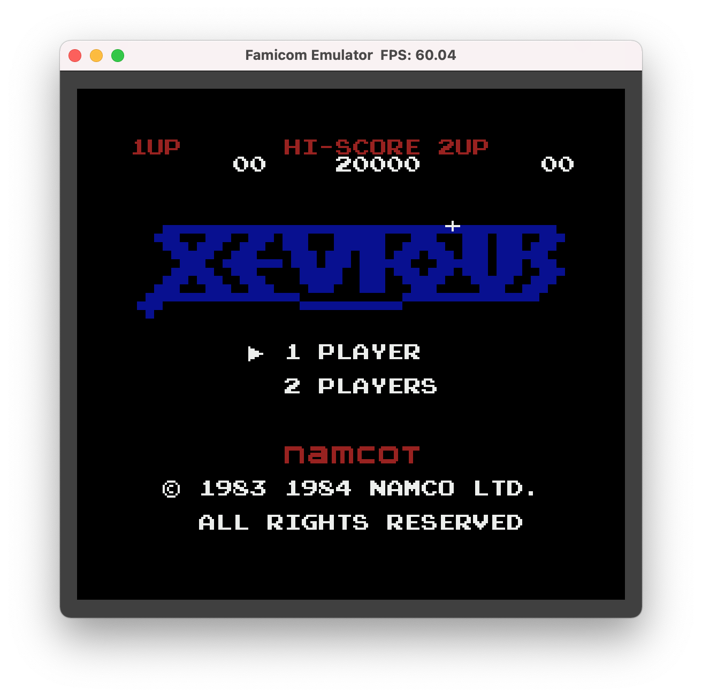
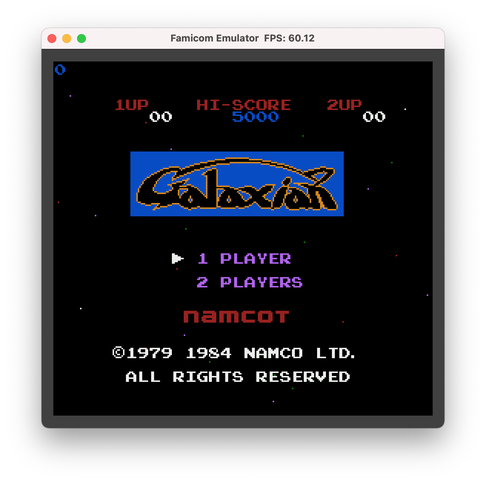
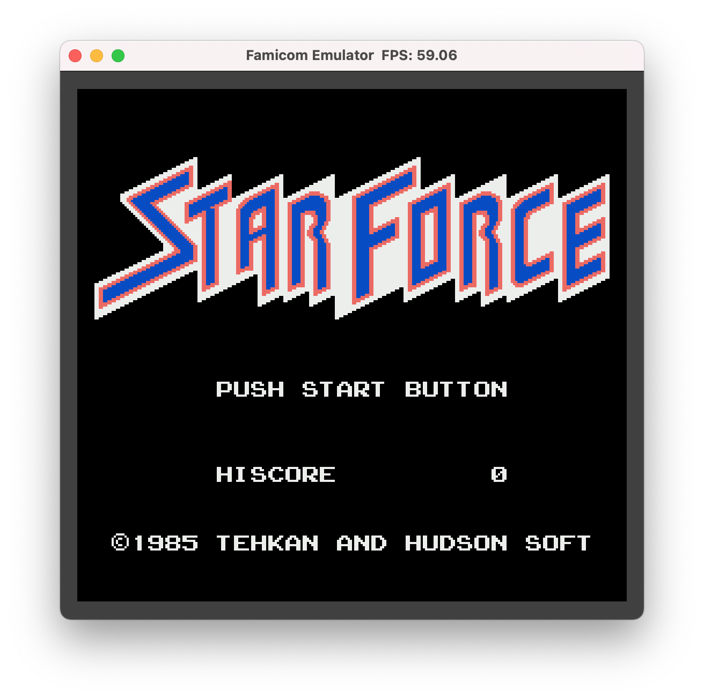
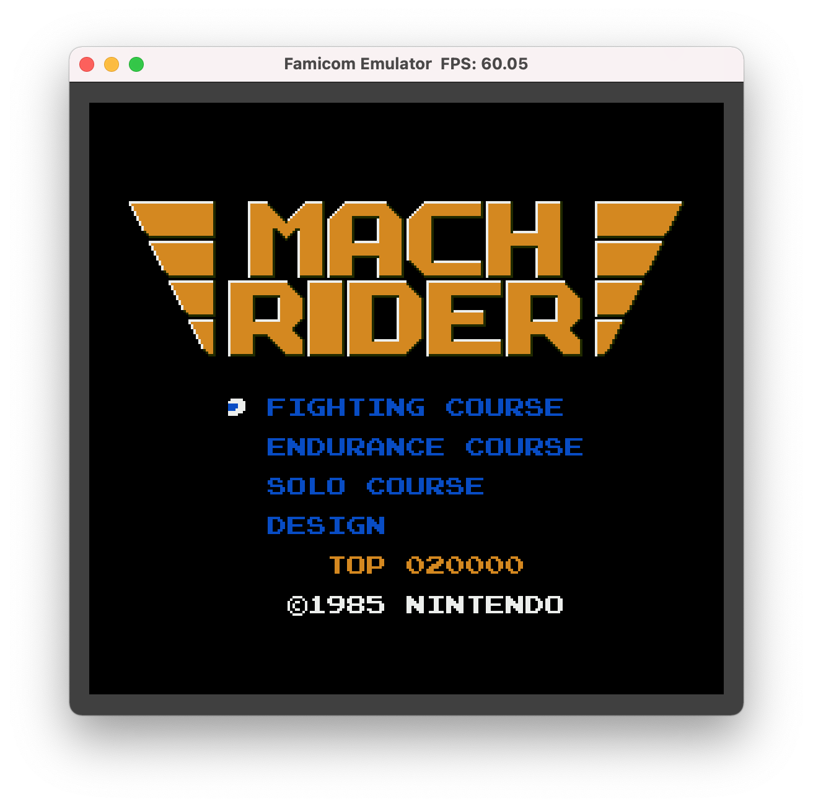
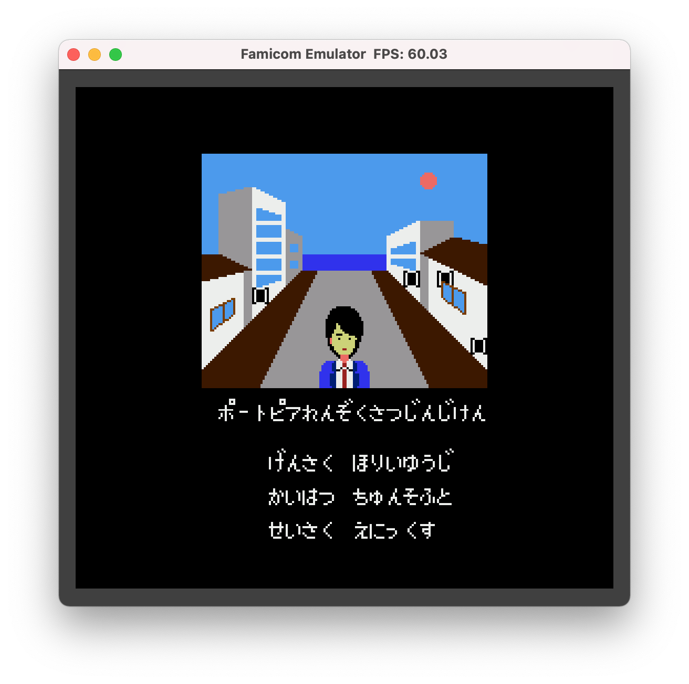

# ANESE: A NES Emulator

## Overview
- An NES Emulator
- Written in C
- Requires GLFW and OpenAL
- Support mapper 0
- No audio supoprt yet

## Features
- Support game pad
- Show tile pattern
- Show tile grid
- Show sprite grid
- A, S, W, D -> cross button
- K, L -> B and A buttons
- B, N -> select and start buttons
- R -> buttons

## Build
- `$ make`
    - Builds nes
- `$ make test`
    - Builds nes and runs test

## Play
- `$ ./nes your_game.nes`

## Platforms
- MacOS with clang

## License
- MIT License

