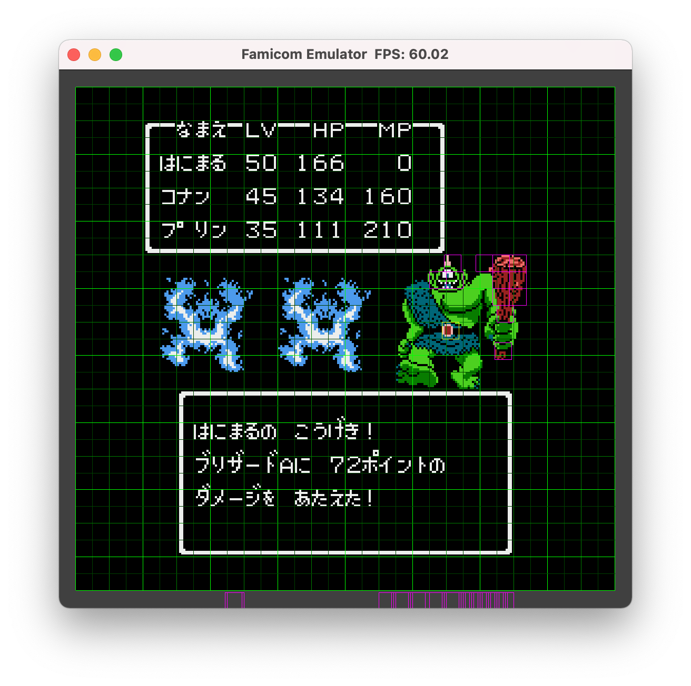

# Famulator: A Famicom/NES Emulator

## Overview
- A NES Emulator
- Written in C++
- Requires GLFW and OpenAL
- Supports mapper 0, 1, 2, 3, 4, 16, 19 (200+ games)

## Features
- Game pad support
- A, S, W, D -> cross button
- K, L -> B and A buttons
- B, N -> select and start buttons
- R -> reset button
- P -> Show tile pattern
- G -> Show tile and sprite grid
- F1 -> Save emulator state
- F2 -> Load emulator state
- Five audio channels supoprted
- No multi player supoprt yet

## Build
- `$ make`
    - Builds nes
- `$ make test`
    - Builds nes and runs test

## Play
- `$ ./nes your_game.nes`

## Platforms
- MacOS with clang

## License
- MIT License

## Under development
- Save/load emulator status
- Switching to SDL2
- More mappers

 

