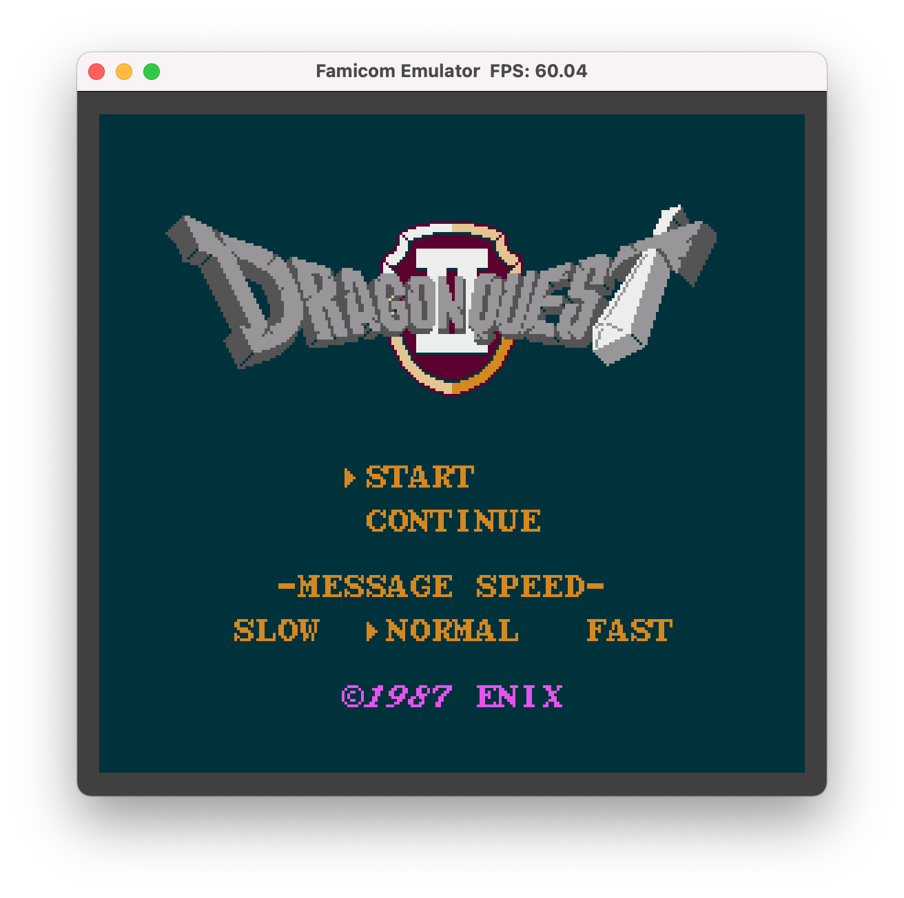

# Famulator: A Famicom/NES Emulator


## Overview
- A NES Emulator
- Written in C++
- Requires GLFW and OpenAL
- Supports mapper 0, 1, 2, 3, 4, 10, 16, 19, 76 (200+ games)
- Built on MacOS with clang

## Features
- Gamepad support
- A, S, W, D -> cross button
- K, L -> B and A buttons
- B, N -> select and start buttons
- R -> reset button
- P -> Show tile pattern
- G -> Show tile and sprite grid
- Space -> Play/Pause emulator
- F1 -> Save emulator state
- F2 -> Load emulator state
- Audio On/Off -> '`', 1, 2, 3, 4, 5 (ALL, pulse1, pulse2, triangle, noise, DMC)
- No multiplayer support yet

## Build
- `$ make`
    - Builds nes
- `$ make test`
    - Builds nes and runs test

## Play
- `$ ./nes your_game.nes`

## Debug Tools
- Emulator pause and play  -> `Space` key
    - Displaying pause status on the bottom of screen when paused
    - Displaying information on CPU, PPU and cartridge on the left
    
- Display Tile Grid -> `G` key
    - The background tile grid follows the PPU scroll per scanline
    
    - The sprite grid shows the OAM data when the cursor hovers      
    
- Display Tiles and OAM -> `P` and `O` keys
    - Updating their graphics per frame in real time
    - Tile pattern and OAM pattern can be turned on/off independently
    
- Stepping through instructions, scanlines and frames  -> `7` to `0` keys
    - Displaying PPU cycle and scanline in blue lines
    - Step to next instruction -> Pause emulator then hit `7`
    - Step to next scanline -> Pause emulator then hit `8`
    - Step to next 8th scanline -> Pause emulator then hit `9`
    - Step to next frame -> Pause emulator then hit `0`    
    
- Turning on/off individual audio channels -> `` ` `` and `1` to `5` keys
    - Mute/unmute all channels -> `` ` `` key
    - Mute/unmute individual channel -> `1` to `5` keys
    - Displaying channel status on top of screen unless playing them all
    
- Information on CPU, PPU and Cartridge
    - Displaying the CPU registers when paused
    - Displaying the PPU registers when paused
    - Displaying the cartridge registers including bank info
    
- Save/Load emulator statu
    - `F1` to save and `F2` to load
    - The status file name is the `nes_file_name.nes.stat`
    - The status file is text format and easy to view and/or modify
        ```
        nes.cpu.total_cycles_ 0000000007EAC5EF
        nes.cpu.suspended_ 00
        nes.cpu.a_   00
        nes.cpu.x_   08
        nes.cpu.y_   05
        nes.cpu.s_   FA
        nes.cpu.p_   22
        nes.cpu.pc_  DB20
        nes.cpu.wram_
            FF 00 00 11 00 00 50 78  04 7E F8 06 04 00 80 00
            6F 00 4A B8 08 0C 0F 15  12 10 20 08 03 00 03 01
            01 17 17 23 87 99 AC 0D  0F 15 F0 00 50 01 00 00
            0F 03 C8 3D 00 00 88 00  08 05 18 00 00 00 00 00
            00 00 00 00 05 04 00 00  00 EE 00 00 00 1C 05 BF
            80 E1 80 0A 04 B4 80 BA  80 00 01 02 FF 06 FF FF
            07 08 FF 0A 0B 00 00 00  00 00 00 00 02 5F 5F 5F
            5F 5F 5F 00 FA 5F FA 00  00 00 00 00 05 1C 05 00
            ...
        ```
    - Modifying the work RAM allows cheating    
    
- Battery backed up RAM
    - The RAM file name is `nes_file_name.nes.sram`
    - The RAM file is raw binary format which means there is compatibility with some other emulators

<!--
## Screenshots
 


-->

## License
- MIT License